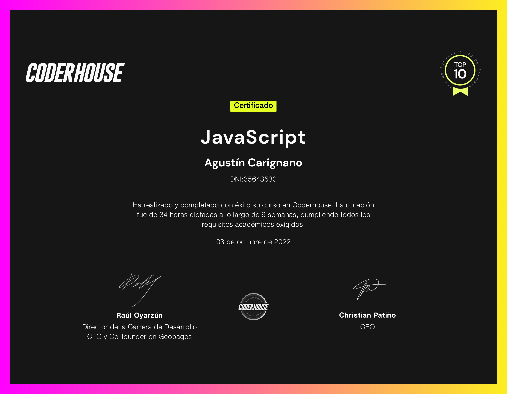

<h1 align="center"> Barroca - JS Project </h1>

Barroca es un e-commerce de ropa, el cual trabajé primero como proyecto del curso de desarrollo web y al que luego agregué funcionalidades utilizando java script.

## Breve descripción.

Como la idea era agregar interactividad al sitio, solo trabajé sobre la pagina de productos. Estos ahora son cargados de forma dinámica, simulando una petición a una base de datos.
Se pueden agregar productos al carrito, acceder al mismo y luego agregar o quitar, y avanzar con una simulación de un proceso de compras completo.

## Deploy del proyecto

Para visualizar la aplicación, haz click en el siguiente enlace: [Barroca](https://agustincarignano.github.io/proyectoJS-carignano/)

## Descargue una copia del repositorio:

    git clone https://github.com/AgustinCarignano/ProyectoReact-Carignanao.git

## Créditos

Profesor: Riverol, Daniel.

Alumno: Carignano, Agustín.

## Certificado del curso

